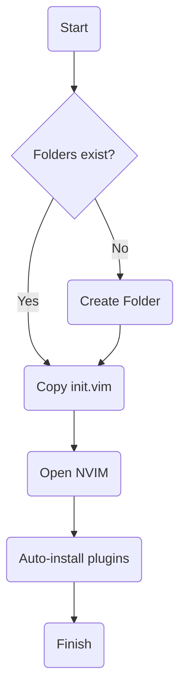

# Welcome to Austin's NVIM Config

This is my attempt at a portable, cross platform NVIM script to make NVIM my 
goto text editor. Special thanks to Reece Stevens for encouraging me to pursue 
this option.

## Installation

### TL; DR Installation
1. Clone the repository
2. chmod +x ./install.sh
3. ./install.sh 

### Installation Summary
Installation is automated using a shell script that checks for NVIM 
directories. If the directories do not exist, they are created. Once the 
directories are found or created, the init.vim file is copied to:

> ~/.config/nvim

Once NeoVIM is launched, Plugins should be automatically downloaded and ready 
to use.

## Features
- jk is mapped to \<Esc> in insert mode
- Tabs are set to 4 characters 
- Numbered lines
- Column marker at 80 characters
- Spell checking (en_us)
- Plugins
    - Plugged plugin manager
    - JavaScript and TypeScript syntax highlighting
    - Nerd Tree (mapped to df)
    - Markdown Preview (<C-p>)
    - Vim-Doge Doxygen comment generate (<C-d>)

